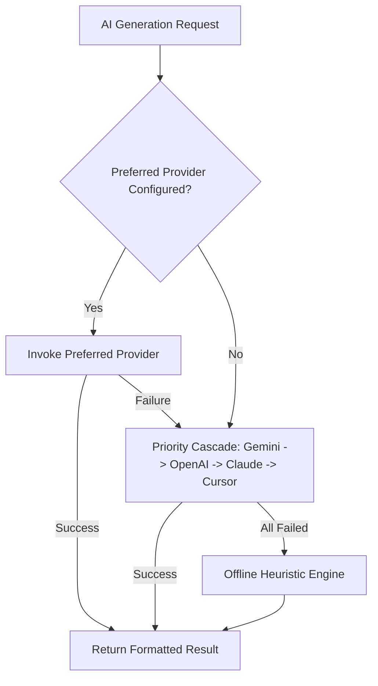

# OfferCraft AI (ResumePilot) — Technical Architecture & Engineering Documentation

This document provides an engineering-level deep dive into the architecture, design decisions, data models, state synchronization, AI pipelines, and rendering engines of **OfferCraft AI (ResumePilot)**.

---

## 1. System Architecture Overview

OfferCraft AI is built on **Next.js 15 App Router** paired with **React 19**, **TypeScript**, and **Tailwind CSS**. It follows a local-first single-page application (SPA) topology with serverless API route handlers for AI processing and PDF compilation.

```
+-------------------------------------------------------------------------------+
|                                CLIENT BROWSER                                 |
|                                                                               |
|  +-------------------+  +------------------------+  +----------------------+  |
|  |   AppSidebar      |  | DynamicProgressHeader  |  |  Active Module Canvas|  |
|  | (Core / AI Suite) |  | (3-Step Progress Bar)  |  | (JD, Profile, Studio)|  |
|  +-------------------+  +------------------------+  +----------------------+  |
|                                                                               |
|  +-------------------------------------------------------------------------+  |
|  |                 Zustand Global State Store (useAppStore)                |  |
|  |          - Persistent Storage Layer: JSON Serializer -> localStorage    |  |
|  |          - Top-Level SSR Mount Guard (Eliminates Hydration Mismatches)   |  |
|  +-------------------------------------------------------------------------+  |
+-------------------------------------------------------------------------------+
                                      |
                                      | HTTP REST / JSON
                                      v
+-------------------------------------------------------------------------------+
|                         NEXT.JS SERVERLESS API LAYER                          |
|                                                                               |
|  /api/parse-resume       /api/generate-resume     /api/rewrite-bullet         |
|  /api/cover-letter       /api/interview-prep      /api/compile-pdf            |
|  /api/career-copilot     /api/providers           /api/resumes                |
+-------------------------------------------------------------------------------+
           |                                                   |
           v                                                   v
+---------------------------------------+   +-----------------------------------+
|       AI ORCHESTRATION ENGINE         |   |      DOCUMENT COMPILERS           |
|                                       |   |                                   |
| 1. Google Gemini (2.5 Flash / 1.5 Pro)|   | - Client: jsPDF + html2canvas     |
| 2. OpenAI (GPT-4o / GPT-4o-mini)      |   | - Browser: @media print CSS       |
| 3. Anthropic Claude (3.5 Sonnet)      |   | - Server: pdflatex (TeX Live)     |
| 4. Cursor SDK Local Agent             |   | - Parser: unpdf / pdf-parse-fork  |
| 5. Offline Heuristic Rule Engine      |   | - Mammoth docx XML reader         |
+---------------------------------------+   +-----------------------------------+
```

---

## 2. Technology Stack

| Layer | Technologies | Purpose |
|---|---|---|
| **Framework** | Next.js 15.1+, React 19, Node.js 20+ | Hybrid App Router, SSR mount guard, Serverless API |
| **Language** | TypeScript 5+ | End-to-end static type safety |
| **Styling** | Tailwind CSS 3.4+, Lucide React | Modern responsive design, dark mode, print media |
| **State Management** | Zustand 5.0+ with `persist` middleware | Synchronous client store, local-first data persistence |
| **AI LLM Integration** | OpenAI SDK, Google Generative AI, Anthropic SDK, Cursor SDK | Multi-model fallback orchestration |
| **Document Parsing** | `unpdf`, `pdf-parse-fork`, `zlib`, `mammoth` | 5-tier resilient PDF/DOCX document text extraction |
| **Document Export** | `jspdf`, `html2canvas`, `jszip`, LaTeX syntax | Vector PDF export, ZIP bundling, LaTeX typesetting |

---

## 3. Top-Level SSR Mount Guard & Hydration Architecture

### The Hydration Challenge
OfferCraft AI stores rich user data (`user`, `jd`, `profile`, `library`, `applications`) in `localStorage` via Zustand. During Server-Side Rendering (SSR):
1. The server environment has no `localStorage`. Zustand initializes with empty defaults.
2. The browser environment loads data from `localStorage` synchronously upon boot.
3. If React hydrates the server HTML against the client virtual DOM before synchronization, a **React Hydration Mismatch (`Hydration failed`)** is triggered.

### The Solution: Top-Level Mount Guard in `src/app/page.tsx`
```tsx
export default function Home() {
  const [mounted, setMounted] = useState(false);

  useEffect(() => {
    setMounted(true);
  }, []);

  if (!mounted) {
    return (
      <div className="min-h-screen bg-slate-50 dark:bg-slate-950 flex flex-col items-center justify-center">
        <OfferCraftBootSplash />
      </div>
    );
  }

  return <MainWorkspace />;
}
```
* **Server Execution**: Renders `OfferCraftBootSplash`.
* **Client Initial Hydration**: Renders `OfferCraftBootSplash`. **Match is 100% identical.**
* **Post-Hydration (`useEffect`)**: `mounted` flips to `true`, rendering the interactive workspace populated with `localStorage` state. Zero hydration mismatch warnings.

---

## 4. Multi-Model AI Orchestration Engine (`src/lib/ai-service.ts`)

The AI engine implements an automated cascading fallback mechanism:



### Provider Models & Capabilities:
1. **Google Gemini**:
   - Model: `gemini-2.5-flash` / `gemini-1.5-pro`
   - Latency: ~1.2s – 2.0s
   - Features: High-throughput token generation, strict JSON schema output.
2. **OpenAI**:
   - Model: `gpt-4o-mini` / `gpt-4o`
   - Latency: ~1.5s – 3.0s
   - Features: `response_format: { type: "json_object" }` enforcement.
3. **Anthropic Claude**:
   - Model: `claude-3-5-sonnet-20241022`
   - Features: Nuanced writing tone, executive accomplishments.
4. **Cursor SDK**:
   - Local agentic execution via `@cursor/sdk`.
5. **Offline Heuristic Rule Engine**:
   - Deterministic keyword extraction, n-gram TF-IDF matching, and pre-compiled LaTeX templates for zero-API-key operation.

---

## 5. 5-Tier Document Parsing Pipeline (`src/lib/pdf-parser.ts`)

Resumes arrive in unpredictable formats and encodings. The parser employs a multi-stage fallback:

1. **Tier 1: `unpdf` Engine**: Modern WebAssembly-based PDF.js extraction.
2. **Tier 2: `pdf-parse-fork`**: Node.js buffer-based parser for standard PDFs.
3. **Tier 3: Low-Level `zlib` Stream Decompressor**:
   - Decompresses raw `/FlateDecode` streams.
   - Parses low-level PDF text operators (`Tj`, `TJ`, hex strings, and kerning shifts).
4. **Tier 4: Printable ASCII/UTF-8 Buffer Scanner**:
   - Recovers unencoded plain text from damaged or partially corrupt PDF structures.
5. **Tier 5: Word Document (`mammoth`) Engine**:
   - Converts DOCX XML nodes into clean plain text and Markdown.

---

## 6. LaTeX Template Engine (`src/lib/latex.ts`)

OfferCraft AI provides 4 professional, ATS-verified LaTeX templates:

1. **Tech Standard (Jake's Resume)**:
   - Packages: `latexsym`, `fullpage`, `titlesec`, `marvosym`, `verbatim`, `enumitem`, `hyperref`, `fancyhdr`, `babel`, `tabularx`.
   - Layout: Standard 1-column layout with section rules (`\titlerule`) and bold dates.
2. **Modern Clean**:
   - Sans-serif styling (`helvet`), clean left-aligned typography, and minimal dividers.
3. **Classic Academic**:
   - Formal serif font (`mathptmx`), detailed publication/coursework sections.
4. **Compact Executive**:
   - Dense layout designed for 10+ years of leadership experience.

---

## 7. Global State Management (`src/lib/store.ts`)

Global state is managed by Zustand with `persist` middleware:

```typescript
interface AppState {
  // Candidate Profile
  profile: CandidateProfile;
  user: UserAccount | null;
  // Job Description
  jd: JobDescriptionState;
  // AI Tailoring Results
  result: TailorResult | null;
  editableLatex: string;
  selectedTemplate: "jakes" | "modern" | "academic" | "compact";
  // Pro Gating & Credits
  isPro: boolean;
  proPlan: "free" | "monthly" | "lifetime";
  trialCreditsRemaining: number;
  tailoredCount: number;
  // Saved Libraries & Pipeline
  library: SavedResume[];
  applications: JobApplication[];
}
```

* **Persistence Key**: `"tailor-resume-storage"`
* **Storage Medium**: `window.localStorage`
* **JSON Backup**: Full workspace export and import support.

---

## 8. API Route Specifications

| Route | Method | Payload | Description |
|---|---|---|---|
| `/api/parse-resume` | `POST` | `multipart/form-data` | Parses uploaded PDF/DOCX and returns extracted text |
| `/api/generate-resume` | `POST` | `{ resumeText, jobDescription, provider }` | Executes AI tailoring and returns structured JSON + LaTeX |
| `/api/rewrite-bullet` | `POST` | `{ bullet, targetRole, style, provider }` | Rewrites a single bullet point using Google XYZ formula |
| `/api/cover-letter` | `POST` | `{ resumeText, jobDescription, provider }` | Generates a 1-page targeted cover letter |
| `/api/interview-prep` | `POST` | `{ resumeText, jobDescription, provider }` | Generates 6+ role-specific STAR interview questions |
| `/api/career-copilot` | `POST` | `{ messages, resumeText, jobDescription }` | Streaming interactive career advice co-pilot |
| `/api/compile-pdf` | `POST` | `{ latexSource }` | Compiles LaTeX via server `pdflatex` (if available) |
| `/api/providers` | `GET` | None | Returns active AI providers based on server `.env` |

---

## 9. Build & Deployment

### Local Development
```bash
npm run dev
```

### Production Build
```bash
npm run build
npm run start
```
* **Output**: Fully optimized `.next` standalone bundles with static route generation for instant page loads.
