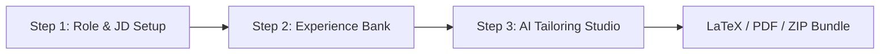

# OfferCraft AI (ResumePilot) — User Usage & Workflow Guide

Welcome to **OfferCraft AI (ResumePilot)**, an end-to-end AI career intelligence suite engineered to transform raw candidate experiences into high-impact, ATS-optimized resumes, cover letters, and STAR interview prep blueprints.

---

## 🧭 The 3-Step Guided Workflow

OfferCraft AI organizes candidate preparation into a streamlined, high-converting 3-step sequence:

### Step 1: Target Role & Job Description (`jd`)
* **Purpose**: Define the target position, extract recruiter keywords, and set the evaluation benchmark.
* **Ways to Supply a Job Description**:
  1. **Role Archetypes (1-Click Presets)**: Choose from 15+ curated industry archetypes (e.g., Staff SWE, GenAI Engineer, Technical Program Manager, Product Lead, Data Architect).
  2. **URL Scraper**: Paste a live job posting link (LinkedIn, Greenhouse, Lever, Indeed) to auto-extract the role details.
  3. **Direct Text**: Paste the full job description text directly into the editor.
  4. **Sample JD**: Click **"Try Sample JD ⚡"** for a quick 1-click test with enterprise program manager requirements.
* **Proceed**: Click **"Proceed to Candidate Profile →"** to advance to Step 2.

---

### Step 2: Master Candidate Experience Bank (`profile`)
* **Purpose**: Establish your complete career history and credentials. No hardcoded or dummy profiles are used—first-time users start with a clean workspace.
* **Input Methods**:
  1. **Upload Existing Resume**: Supports **PDF, DOCX, DOC, TXT, Markdown, TeX, RTF, HTML, and JSON**.
     - Powered by a 5-tier fallback parser (`unpdf`, `pdf-parse-fork`, `zlib` stream decoder, ASCII extractor, and `mammoth`).
  2. **Raw Text Input**: Paste raw resume bullet points directly.
  3. **Structured Form Editor**: Input individual work experiences, projects, education, and technical skills.
  4. **Sample Candidate**: Click **"Try Sample Experience ⚡"** to test with an engineer profile.
* **Google Cloud Sync & User Profile**:
  - Click the candidate badge in the top bar or sidebar to view/edit your candidate name, target title, and cloud synchronization status.
* **Proceed**: Click **"Proceed to Studio →"** to tailor your resume.

---

### Step 3: Interactive AI Tailoring Studio & LaTeX Export (`studio`)
* **Purpose**: Tailor your resume against the target JD, view live ATS impact metrics, customize typography, and export.
* **Key Capabilities**:
  1. **Live A4 Document Preview**:
     - Real-time semantic rendering matching exact LaTeX layout rules.
     - Zoom controls (`75%`, `100%`, `125%`).
  2. **4 ATS-Compliant LaTeX Templates**:
     - **Tech Standard (Jake's Resume)**: Standard for Engineering, Data & DevOps.
     - **Modern Clean**: Sleek sans-serif typography with subtle dividers.
     - **Classic Academic**: Formal serif layout for Research, Legal & Higher Ed.
     - **Compact Executive**: High-density 2-column layout for Senior Directors/VPs.
  3. **Inline AI Bullet Rewriter**:
     - Click any bullet point on the live A4 sheet to open the contextual rewriter.
     - Choose from **Google XYZ Formula**, **Executive Tone**, **Add Hard Metrics**, or **ATS Keyword Infusion**.
  4. **LaTeX Code Inspector**:
     - Switch to the **LaTeX Code** tab to edit the raw `.tex` source in real time with syntax highlighting.
  5. **Export Options**:
     - **Download PDF**: Client-side high-resolution vector PDF export.
     - **Print Document**: Browser native print dialog optimized via `@media print`.
     - **Download .TEX**: Raw LaTeX source code for Overleaf or local compilation.
     - **1-Click Application Bundle**: Downloads a full ZIP package with your tailored resume, custom cover letter, STAR prep kit, and tracking sheet.

---

## ⚡ AI Career Acceleration Suite

Beyond resume tailoring, OfferCraft AI provides standalone career intelligence modules accessible from the sidebar:

### 1. ATS Resume Checker (Google XYZ Audit)
* **Screen ID**: `general`
* Evaluates your current resume **without requiring a job description**.
* Scans every bullet against the Google XYZ formula:
  $$\text{Accomplished [X]} \text{ as measured by [Y]}, \text{ by doing [Z]}$$
* Delivers section-by-section health grades (A through F), identifies passive verbs, and highlights missing quantitative metrics.

### 2. LinkedIn Profile Optimizer (Recruiter SEO)
* **Screen ID**: `linkedin`
* Generates 5 high-converting headlines tailored to recruiter search queries.
* Crafts an engaging, first-person "About" summary with bold achievements and core competencies.
* Recommends top 25 recruiter keyword search tags.

### 3. STAR Interview Coach & Practice Studio
* **Screen ID**: `interview`
* Analyzes your candidate background against the target JD to generate 6+ high-yield interview questions:
  - Technical architecture & system design
  - Behavioral leadership & conflict resolution
  - Situational problem-solving
* For each question, offers a structured **STAR blueprint** (Situation, Task, Action, Result) with sample talking points.

### 4. Application Pipeline & Offer Tracker (Kanban)
* **Screen ID**: `tracker`
* Interactive drag-and-drop Kanban board for job applications:
  - Columns: *Applied*, *Screening*, *Technical Round*, *Final Interview*, *Offer Received*, *Archived*.
* Records company names, target roles, salary bands, application dates, and interview notes.

### 5. OfferCraft Academy (GenAI Bible)
* **Screen ID**: `learning-hub`
* Comprehensive curriculum covering Generative AI engineering, LLM application architecture, prompt engineering, RAG pipelines, fine-tuning, and AI interview questions.

---

## 💎 Pro Tier & Credit System

OfferCraft AI features a credit-based tiering system:
* **Free Trial**:
  - Every new user starts with **1 Free Trial Credit** allowing full access to resume generation, ATS scoring, and LaTeX export.
* **Pro Tier Upgrade**:
  - Unlocks unlimited resume generations, multi-template switching, cover letter generator, STAR interview coach, and 1-click application bundle downloads.
  - Click the **"Upgrade to Pro"** button or crown icon in the header to activate Pro status.

---

## 🔒 Data Privacy & Workspace Backup

1. **Local-First Architecture**:
   - Candidate resumes, notes, and pipeline records are saved securely in your browser's `localStorage`.
   - Your data is not sold or shared with third parties.
2. **Workspace Backup & Restore**:
   - Click the **Backup / Restore** icon in the sidebar.
   - **Export Workspace**: Saves all your profiles, JDs, tailored resumes, and Kanban records into a single JSON file.
   - **Import Workspace**: Restores your complete workspace onto any computer with 1 click.

---

## ❓ Frequently Asked Questions (FAQ)

**Q: Do I need an OpenAI or Gemini API key to use OfferCraft AI?**  
A: No. The application features a robust offline heuristic engine that can parse resumes, extract keywords, and generate clean LaTeX resumes without any external API keys. Adding an API key in `.env.local` enables advanced LLM rewriting.

**Q: Why do I see a brief splash screen on initial page load?**  
A: The splash screen is OfferCraft AI's SSR mount guard. It ensures that data loaded from your browser's local storage seamlessly hydrates without React hydration warnings.

**Q: How do I compile the LaTeX source code offline?**  
A: You can open the downloaded `.tex` file in [Overleaf](https://www.overleaf.com/) or compile it locally with `pdflatex resume.tex` using TeX Live or MiKTeX.
